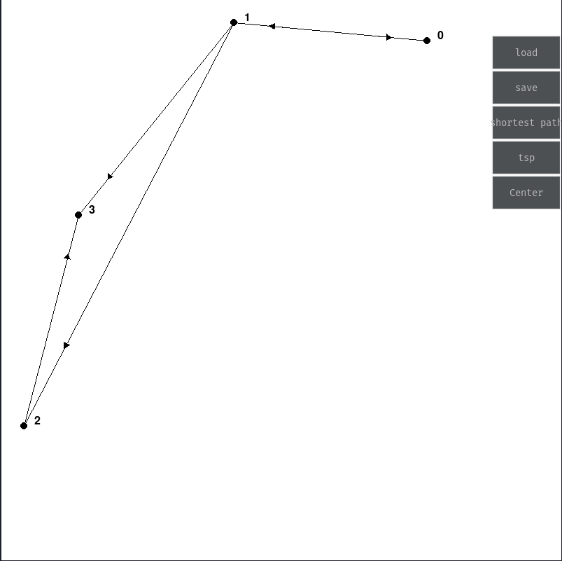
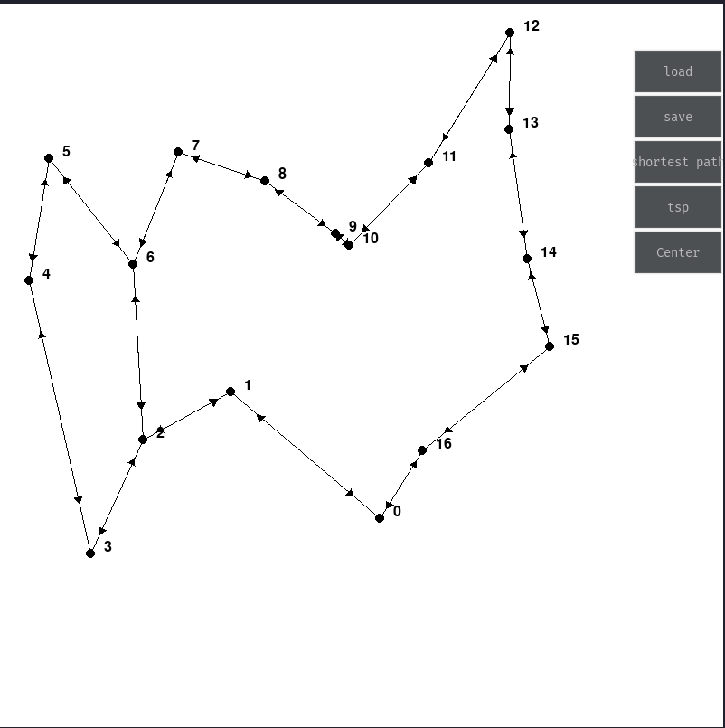
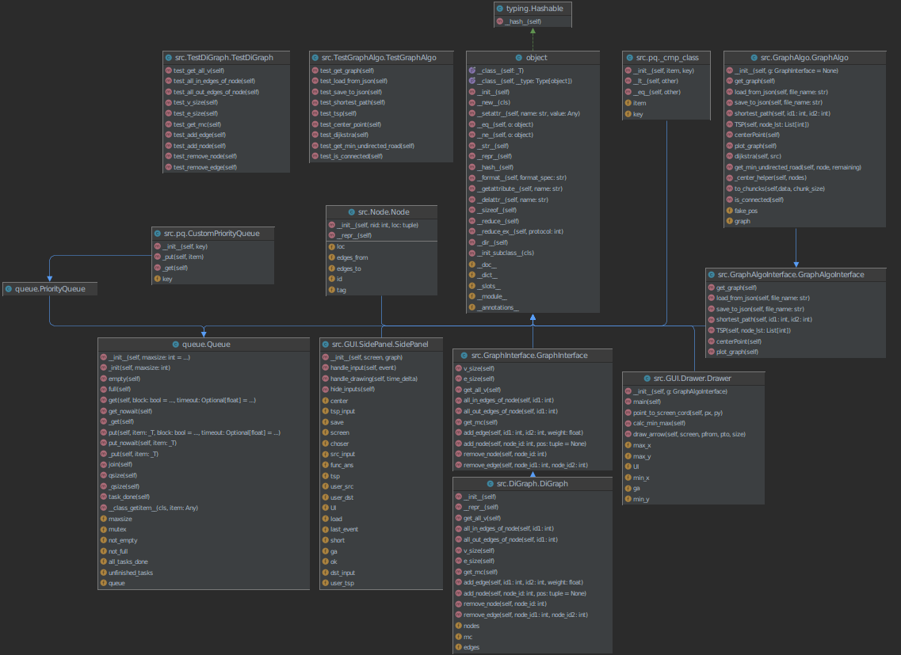

## Ex3 OOP class - ariel CS

In this assigment we were given the following interfaces:

| Interface                       | Description                                                        |
|---------------------------------|--------------------------------------------------------------------|
| GraphAlgoInterface              | This interface represents a directed weighted grpah                |
| GraphInterface                  | This interface allows us to run some basic algorithms on our graph |

We were also given an `main.py` file with some static methods to test the names of our function and some basic 
functionality.

## Folder Structure

The workspace contains two folders by default, where:

- `src`: the folder to maintain sources
    - `GUI`: the folder where all the Gui related files are
- `data`: the folder which contains all of our graphs are

## Testing
this project was test using the UniTest library. the tests can be run by an IDE of choice.

## Running the program
To run this project, first of all make sure you have all the dependncies:

    pip install pygame
    pip install pygame_gui

after that you can download and run the project with:

    git clone https://github.com/Daniel-Ros/OOP4.git
    cd OOP4
    python src/Ex3.py

## images

##  Results

These are the final results that I was able to get

| size   | algorithm        | time to finish in seconds  |
|--------|------------------|-------------------------------|
 | 100    | shortestPath     | 0.004                      |
 | 100    | shortestPathDist | 0.004                        |
 | 100    | center           | 0.102                        |
 | 1000   | shortestPathDist | 0.048                         |
 | 1000   | center           | 8.43                          |
 | 1000   | tsp              | 0.0965                           |
 | 10000  | shortestPathDist | 0.593                           |
 | 10000  | center           | 1082.5779                          |
 | 10000  | tsp              | 1.183                        |
 | 100000 | shortestPathDist | 0.01                          |
 | 100000 | center           | > 30 min                      |
 | 100000 | tsp              | 88.59                       |

## uml
 

## Assigment Instructions
[here](https://docs.google.com/document/d/15sTWy_pa6Vg4r7phAC322vZA169V02yezjxxf4b9sJc/edit)
